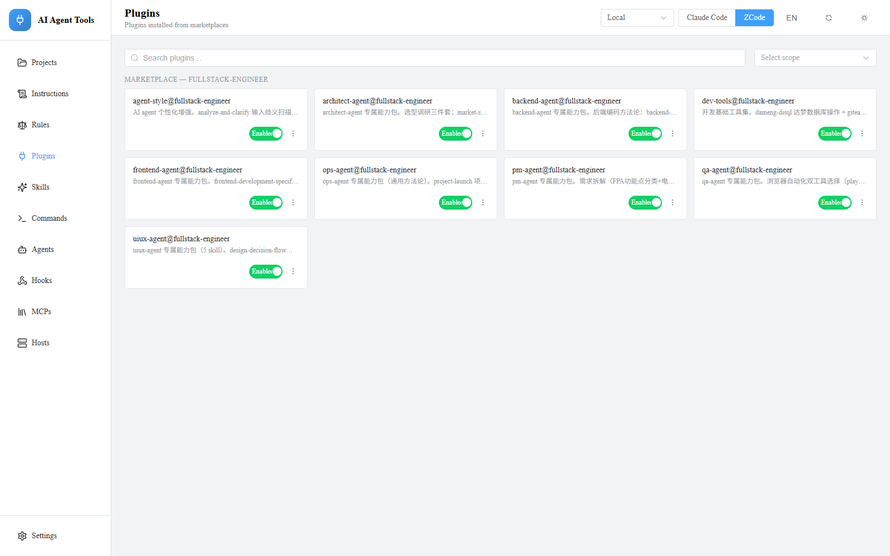
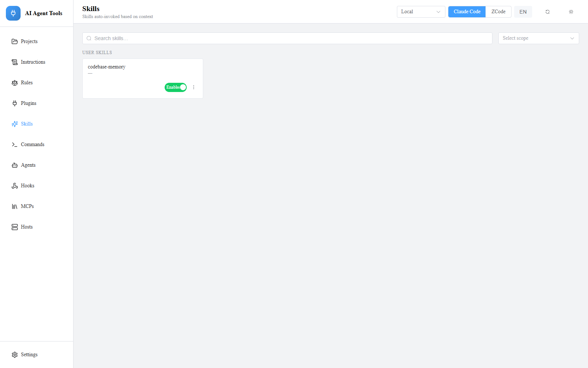
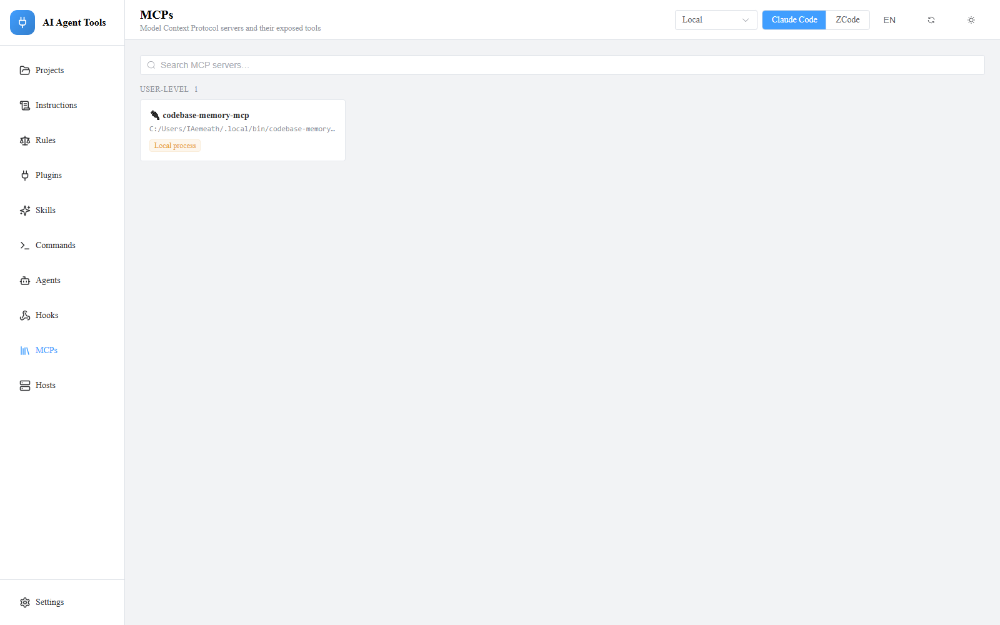
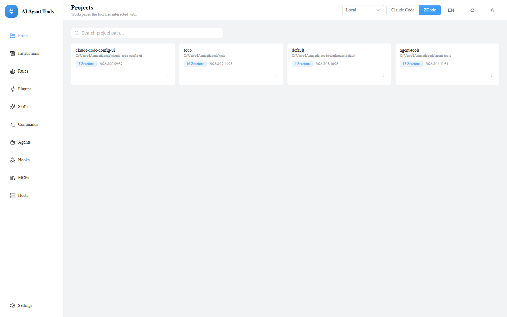

# ai-agent-tools

**One web UI for all your AI coding-agent configs — Claude Code, ZCode, and beyond.**

[](./LICENSE)


[简体中文](./README.zh-CN.md) · [Architecture](./docs/ARCHITECTURE.md)

Skills, plugins, instructions, rules, commands, agents, hooks, MCP servers, projects and settings — manage them across **user / project scopes**, across **tools**, and even **across machines over SSH**, all from one place.



## Highlights

- **Instant toggles, zero restarts** — flipping a skill or plugin writes the tool's *own native* config (`skillOverrides`, `enabledPlugins`), so the change takes effect immediately and is visible to the tool itself.
- **Config-as-SSOT** — no parallel database. The app is a read / project / write layer over your tools' real config files. Every write is key-preserving, atomic, and backed up (`.bak`).
- **Remote hosts are first-class** — pick a host in the top bar and every page rebinds to that machine. Reads and writes execute *on the remote itself* (one tiny bundled script per SSH exec), so a full overview takes **~0.5 s** even over a VPN. Works on Windows and Linux remotes alike.
- **One profile per tool** — every tool difference (directories, settings key paths, value encodings, plugin manifest formats) is declared in a single `ToolProfile` object. Adding a new tool = adding one object; the engine contains zero tool-specific literals. See the 15-line recipe in [Architecture](./docs/ARCHITECTURE.md).

## What you can do

| Resource | Mode | Notes |
|---|---|---|
| Skills | toggle · promote · delete | per-scope detail + computed effective state |
| Plugins | toggle · file browser | browse the plugin dir, preview file contents |
| Instructions · Rules · Commands · Agents | view + **edit** | markdown editor with safe writes; Rules is Claude-only (ZCode has no rules mechanism) |
| Hooks · Settings | read-only dashboards | merges Claude `settings.local.json`; env / permissions / marketplaces overview |
| MCP | read-only + live tool probe | stdio / http / sse transports; probing runs on the selected host |
| Projects | browse · delete history | session stores on filesystem (Claude) or SQLite (ZCode) |

Markdown editing comes with a whitelist check, `.bak` backup and atomic write — edit confidently.

| Skills (per-scope toggles) | MCP servers | Projects (session history) |
|:-:|:-:|:-:|
|  |  |  |

## Quick start

Requires Node 18+. No native toolchain.

```bash
npm install
npm run dev        # API on :8787, UI on :5173
```

Production build: `npm run build && npm start`.

## Status

Claude Code + ZCode are fully covered — all resource pages, markdown editing, remote SSH hosts. MCP editing is deliberately deferred: the tools' toggle mechanisms differ too much to unify honestly, and a fake toggle the tool ignores would be worse than none.

## Acknowledgments & licensing

Early design exploration lives on orphan branches (never merged into `main`): [glyphic](https://github.com/caioricciuti/glyphic) (AGPL-3.0 — stays strictly on its own branch so `main` remains pure MIT) and [claude-code-tool-manager](https://github.com/tylergraydev/claude-code-tool-manager) (MIT).

## License

[MIT](./LICENSE)
