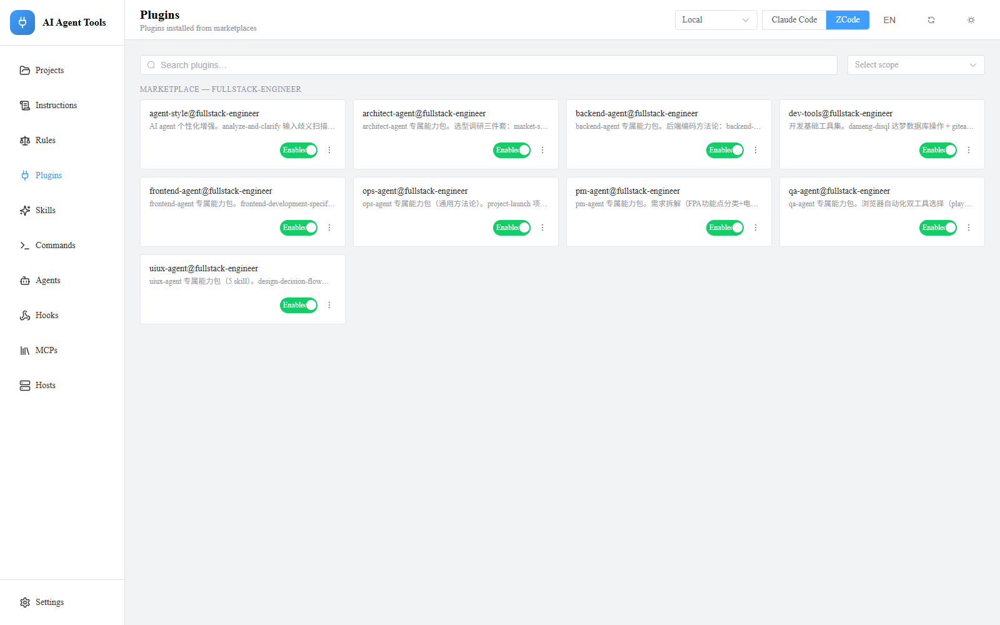
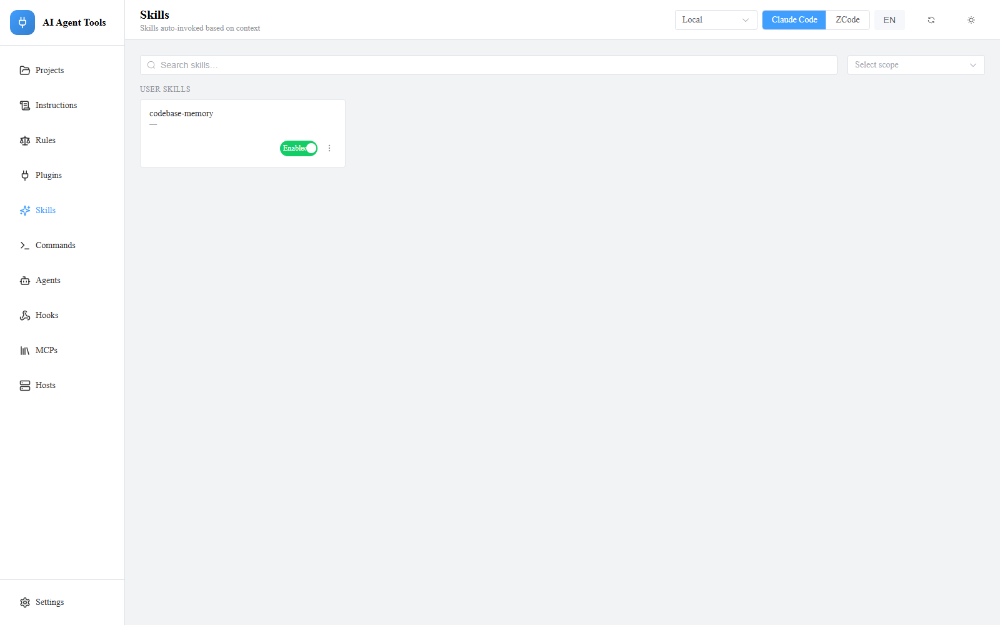
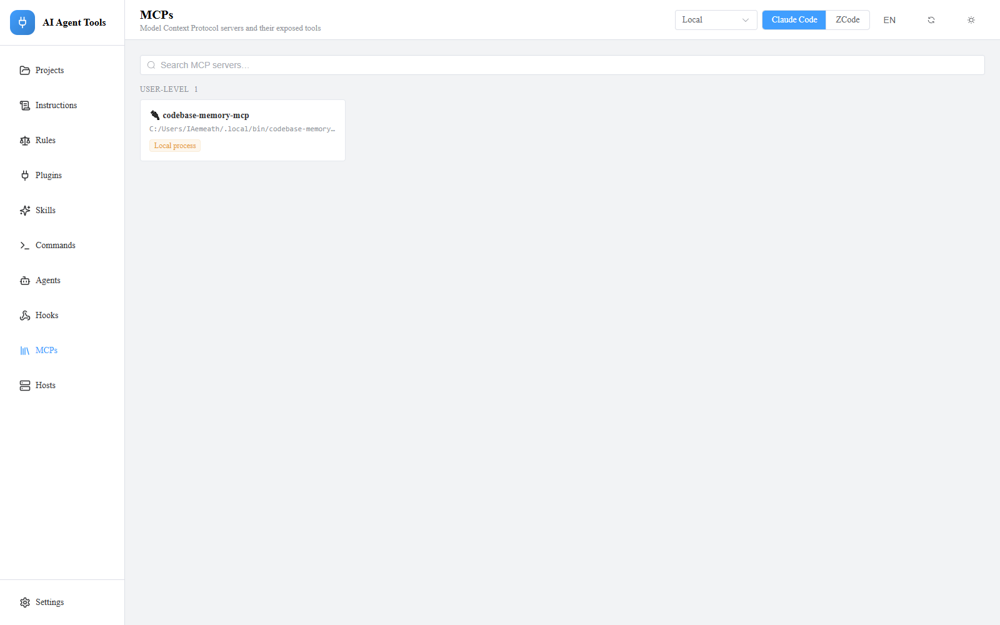
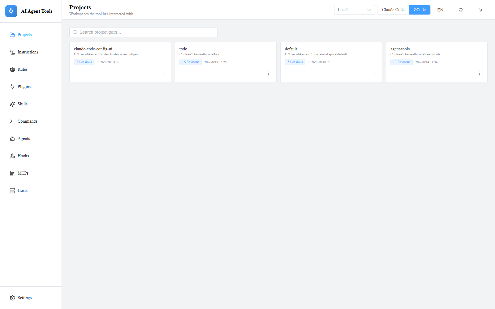

# ai-tools

**一个 Web UI 管理一切 AI 相关工具 —— 编码代理配置、会话复盘、AI 编写的脚本。**

[](./LICENSE)


[English](./README.md) · [架构详解](./docs/ARCHITECTURE.md)

Skills、plugins、instructions、rules、commands、agents、hooks、MCP、projects —— 跨 **user / project 作用域**、跨**工具**、甚至**跨机器(SSH)**,全部集中一处管理;另有**情景记忆(caselog)**与 **AI 脚本控制台**。



## 亮点

- **开关实时生效,无需重启** —— 开关直接回写工具*自身的原生配置*(`skillOverrides`、`enabledPlugins`),工具立刻可见。
- **配置即唯一事实源(Config-as-SSOT)** —— 不建任何平行数据库,应用只是架在工具真实配置文件上的读取/投影/回写层;每次写入保 key 合并、原子落盘、自动 `.bak` 备份。
- **远程主机是一等公民** —— 顶栏切换主机,所有页面整体重定向。读写*在远程本机执行*(每次请求一次 SSH exec 运行一个小脚本),VPN 链路上完整 overview 也只要 **约 0.5 秒**;Windows / Linux 远程都可用。
- **一个工具 = 一个 profile** —— 目录、settings key 路径、值编码、manifest 格式等全部差异,集中声明在一个 `ToolProfile` 对象里;新增工具 = 新增一个对象,引擎零改动、不含任何工具专属字面量。15 行配方见[架构详解](./docs/ARCHITECTURE.md)。

## 功能

| 资源 | 模式 | 备注 |
|---|---|---|
| Skills | 开关 · 提升 · 删除 | 各作用域明细 + 计算后的生效状态 + **加载频次徽标 / 零加载过滤**(转录扫描;仅 ZCode) |
| Plugins | 开关 · 文件浏览器 | 浏览 plugin 目录、预览文件内容 |
| Instructions · Rules · Commands · Agents | 查看 + **编辑** | markdown 编辑器,安全回写;Rules 仅 Claude(ZCode 无此机制) |
| Hooks | 只读总览 | 合并 Claude `settings.local.json` |
| MCP | 只读 + 实时工具探测 | stdio / http / sse;探测在所选主机上运行 |
| Projects | 浏览 · 读会话 · 删除历史 | 文件系统(Claude)或 SQLite(ZCode)会话存储;ZCode 会话可端到端阅读(用户轮次/思考/工具调用/响应) |
| 情景(caselog) | 浏览 · 编辑 · LLM 润色 | 按日分组卡片 + 内联详情;沉浸式阅读/编辑模式;LLM 润色候选保留原文出处 |
| 脚本(AI 编写) | 导入 · 新建 · 运行 | 单进程权威管理(detached 常驻、宿主重启接管);卡片详情页内嵌脚本页面 |

Markdown 编辑带白名单校验 + `.bak` 备份 + 原子写入,放心改。

| 技能(分作用域开关) | MCP 服务器 | 项目(会话历史) |
|:-:|:-:|:-:|
|  |  |  |

## 快速开始

需要 Node 18+,无原生工具链。

```bash
npm install
npm run dev        # 后端 :8787,前端 :5173
```

生产构建:`npm run build && npm start`。单文件可执行版:`npm run build:exe`。应用数据收敛于 `~/.ai-tools`。

## 状态

Claude Code + ZCode 已全覆盖 —— 全部资源页、markdown 编辑、远程 SSH 主机。MCP 编辑暂缓:各工具的开关机制差异过大,强行统一只会造出工具根本不认的"假开关"。

## 致谢与许可

早期设计探索保留在 orphan 分支(从不合入 `main`):[glyphic](https://github.com/caioricciuti/glyphic)(AGPL-3.0 —— 严格留在其独立分支,`main` 保持纯 MIT)与 [claude-code-tool-manager](https://github.com/tylergraydev/claude-code-tool-manager)(MIT)。

## 许可证

[MIT](./LICENSE)
